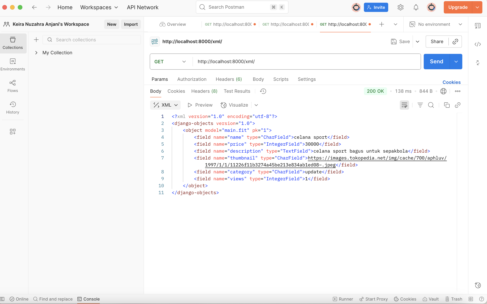
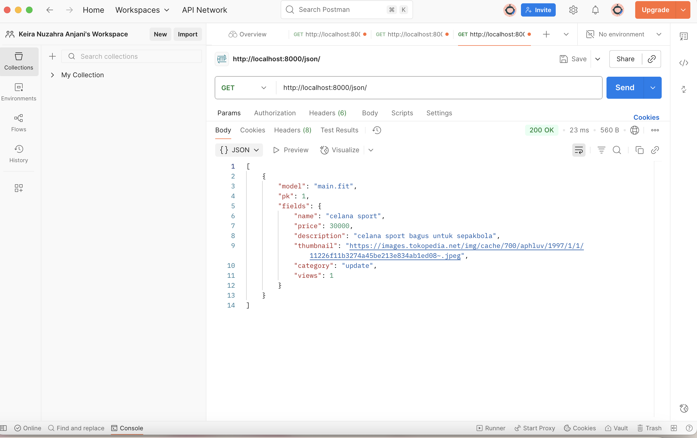

tautan situs web deployment: https://keira-nuzahra-fitzone.pbp.cs.ui.ac.id/

## Tugas 2 
1. Jelaskan bagaimana cara kamu mengimplementasikan checklist di atas secara step-by-step (bukan hanya sekadar mengikuti tutorial).
Jawab= Pertama, saya membuat folder untuk direktori sesuai dengan nama aplikasi (fitzone) kemudian dalam folder tersebut saya membuat dan mengaktifkan virtual environment lalu menambahkan dependencies didalam file requirements dan di instalisasi. Kedua, membuat projek bernama fit_zone di direktori utama kemudian mengkonfigurasi environment variables proyek, lalu jangan lupa untuk migrasi database. Ketiga, membuat aplikasi main kemudian di daftarkan di setting.py bagian INSTALLED_APPS. Keempat, buka file models.py di bagian main, dan mulai di isi sesuai dengan checklist. Kelima, isi file views.py di dalam main dengan fungsi show_main (berfungsi sebagai menampilkan nama aplikasi serta nama dan kelas) kemudian mengatur routingnya didalam main, setelah itu menambahkan pengaturan url lewat urls.py agar proyek bisa menyambung dan melakukan pemetaan ke rute URL pada aplikasi main. Keenam, buat proyek baru di PWS kemudian edit bagian raw environment sesuai dengan isi .env.prod kemudian menambahkan url deployment PWS pada ALLOWED_HOSTS. Ketujuh, lakukan project command pada halaman PWS.

2. Buatlah bagan yang berisi request client ke web aplikasi berbasis Django beserta responnya dan jelaskan pada bagan tersebut kaitan antara urls.py, views.py, models.py, dan berkas html.
Jawab= 

Kaitannya, urls.py bagian menentukan URL mana yang manggil fungsi apa di views.py. Sedangkan, views.py itu seperti yang berpikir (mengatur logika lalu menentukan template yang ditampilkan). Kemudian models.py dipanggil views.py untuk ambil atau simpan data ke database. Terakhir, HTML bagian yg dilihat user (hasil dari pemilihan views.py)

3. Jelaskan peran settings.py dalam proyek Django!
Jawab= file konfigurasi utama di Django seperti bagian otak dalam tubuh manusia. Semua pengaturan proyek ada disini, seperti database, INSTALLED_APPS, templates, konfigurasi keamanan, dll. settings.py semacam otak pengaturan proyek agar bisa berjalan dgn benar.

4. Bagaimana cara kerja migrasi database di Django?
Jawab= pertama makemigrations (python manage.py makemigrations) membuat file migrasi berdasarkan perubahan model, kemudian migrate (python manage.py migrate) menerapkan migrasi itu ke database.

5. Menurut Anda, dari semua framework yang ada, mengapa framework Django dijadikan permulaan pembelajaran pengembangan perangkat lunak?
Jawab= menurut saya karena Django fitur bawaan yang lumayan banyak kemudian phyton based juga sehingga beginner-friendly. Ada juga strukturnya dengan pola MTV sehingga membiasakan untuk menulis kode scr rapi.

6. Apakah ada feedback untuk asisten dosen tutorial 1 yang telah kamu kerjakan sebelumnya?
Jawab= Asisten dosen sudah bagus dan sangat membantu dalam tutorialnya kemarin. Ketika ditanyakan juga ia menjelaskannya mudah dipahami dan ramah jadi tidak malu untuk tanya lagi.

## Tugas 3

1. Jelaskan mengapa kita memerlukan data delivery dalam pengimplementasian sebuah platform?
Jawab = Data delivery itu penting supaya informasi dari server bisa sampai ke user dengan cepat, aman, dan akurat. Mulai dari meningkatkan pengalaman, efisiensi operasi, dan masih banyak lagi. Tanpa data delivery yang bagus maka aplikasi dapat menjadi lambat atau data yang ditampilkan nggak akurat.

2. Menurutmu, mana yang lebih baik antara XML dan JSON? Mengapa JSON lebih populer dibandingkan XML?
Jawab = Menurut saya, lebih baik JSON dikarenakan ringan sehingga lebih cepat diproses dan juga mudah dibaca. Selain itu, struktur datanya juga simpel sehingga lebih mudah untuk diubah menjadi objek diberbagai bahasa pemrogaman.

3. Jelaskan fungsi dari method is_valid() pada form Django dan mengapa kita membutuhkan method tersebut?
Jawab = Method tersebut penting karena berfungsi untuk ngecek apakah data yang dikirim user sesuai aturan form. Sehingga data yang masuk database bersih dan sesuai format, hal ini juga mengurangi error karena data tidak sesuai.

4. Mengapa kita membutuhkan csrf_token saat membuat form di Django? Apa yang dapat terjadi jika kita tidak menambahkan csrf_token pada form Django? Bagaimana hal tersebut dapat dimanfaatkan oleh penyerang?
Jawab = Fungsi csrf_token dalam pembuatan form adalah untuk mencegah serangan berbahaya. Tanpa token ini, memungkinkan pihak luar untuk melakukan tindakan berbahaya atas nama pengguna selain itu permintaan dapat ditolak oleh server. Dengan token ini, django bisa terverifikasi kalau request itu beneran dari website kita sendiri.

5. Jelaskan bagaimana cara kamu mengimplementasikan checklist di atas secara step-by-step (bukan hanya sekadar mengikuti tutorial).
Jawab = Pertama, membuat form FitForm di forms.py yang terhubung ke model.py. Kedua, membuat views di views.py untuk menampilkan daftar produk, tambah produk, lihat detail produk, dan menampilkan data XML/JSON. Ketiga, membuat URL routing di urls.py. Keempat, membuat tampilannya di bagian templates, untuk daftar produk, tambah produk, dan tampilan detail produk. Kelima, mengecek semua fitur di localhost untuk melihat apakah ada error.

6. Apakah ada feedback untuk asdos di tutorial 2 yang sudah kalian kerjakan?
Jawab = Tutorial di website sudah sangat membantu dan penjelasannya mudah dipahami juga.

7. Mengakses keempat URL di poin 2 menggunakan Postman, membuat screenshot dari hasil akses URL pada Postman, dan menambahkannya ke dalam README.md.
Jawab = 

## Tugas 4
1. Apa itu Django AuthenticationForm? Jelaskan juga kelebihan dan kekurangannya.
Jawab = AuthenticationForm adalah form bawaan Django yang dipakai untuk login user, ini digunakan untuk mengecek apakah user ada di database, passwordnya benar atau tidak, dan apakah akun masih aktif. Kelebihannya praktis (tidak perlu membuat fungsi login dari awal), terintegrasi dengan sistem autentikasi django (otomatis pengecekan), dan aman. Kekurangannya tampilannya standar sehingga memerlukan kostumisasi sendiri kalau mau lebih fleksibel (misal menambahkan gmail), tidak cocok kalau perlu field tambahan (misal OTP).

2. Apa perbedaan antara autentikasi dan otorisasi? Bagaiamana Django mengimplementasikan kedua konsep tersebut?
Jawab = perbedaannya jika autentikasi memastikan apakah user terdaftar di database dan password sesuai atau tidak (contoh login user dan password) sedangkan otorisasi memastikan izin akses setiap user bisa ngapain saja. Di Django, autentikasi ditangani dengan django.contrib.auth, login/logout, AuthenticationForm, dll. Sedangkan otorisasi ditangani dengan @login_required, @permission_required, atau user.is_staff.

3. Apa saja kelebihan dan kekurangan session dan cookies dalam konteks menyimpan state di aplikasi web?
Jawab = Cookies, kelebihannya adalah ringan, bisa langsung dibaca dengan JavaScript, dan cocok untuk data sederhana (contohnya menyimpan ID dan preferensi tema) sedangkan kekurangannya adalah  ukuran terbatas hanya 4Kb, sering diubah user, butuhnya keamanan tambahan. Session, kelebihannya adalah lebih aman (data sensitif tidak di client) dan bisa menyimpan banyak data sedangkan kekurangannya adalah butuh resource server (RAM/DB), kalau terlalu banyak user bisa berat.

4. Apakah penggunaan cookies aman secara default dalam pengembangan web, atau apakah ada risiko potensial yang harus diwaspadai? Bagaimana Django menangani hal tersebut?
Jawab = Tidak sepenuhnya aman, risiko potensialnya berupa bisa dicuri via serangan XSS jika HttpOnly nggak dipakai, kemudian dapat diserang lewat jaringan juga jika Secure & HTTPS nggak dipakai. Cara Django menangani ini adalah dengan Cookie session otomatis pakai flag HttpOnly=True (sehingga tidak bisa diakses JavaScript), kemudian pakai SESSION_COOKIE_SECURE=True supaya cookie hanya terkirim lewat HTTPS. 

5.  Jelaskan bagaimana cara kamu mengimplementasikan checklist di atas secara step-by-step (bukan hanya sekadar mengikuti tutorial).
Jawab = Pertama, mengimport autentikasi dan login dari Django, kemudian membuat fungsi loginnya di bagian views.py, kemudian kita buat html nya di berkas login.html, jangan lupa untuk mengeset url pattern nya di urls.py. lakukan hal yang sama untuk logout dan registrasi. nah perbedaannya kita akan menambahkan usercreationform untuk registrasi dan logout dari django untuk logout. Kedua, kita jalankan proyek django untuk dicek berjalan dengan bener atau nggak, nah jika iya kita buat dua akun kemudian login masing masing akun dan buat 3 produk untuk di jual. Ketiga, cara menghubungkannya adalah dengan pertama kita ubah bagian Fit(models.Model) diubah agar berfungsi untuk menghubungkan satu produk dengan satu user melalui sebuah relationship, ditambah juga jika produk tidak ada user maka tidak apa-apa. Lalu migrasi kan file tersebut, kemudian ubah kembali yang bagian create_produk agar ketika pembuatan produk, produk akan di hubungkan dengan si user. lalu ubah juga bagian show_main sehingga dia dapat menfilter mana produk sendiri dan semua produk, jangan lupa tambahkan tombolnya di main.html. Kemudian menunjukan nama penjual (user) ketika produk di pencet (ubah bagian produk_detail.html). Keempat, ubah bagian login untuk menyimpan waktu ketika login terjadi, kemudian dibagian show_main tambahkan waktu login tsb sebagain last_Login, lalu ubah di fungsi logout untuk menghapus cookie last_Login sehingga nantinya ketika logout tidak akan tersimpan, jangan lupa tambahkan di main.html agar terlihat di website. Terakhir, menjawab pertanyaan-pertanyaan dilakukan dengan research mandiri di google dan juga membaca kembali tutorial 4.